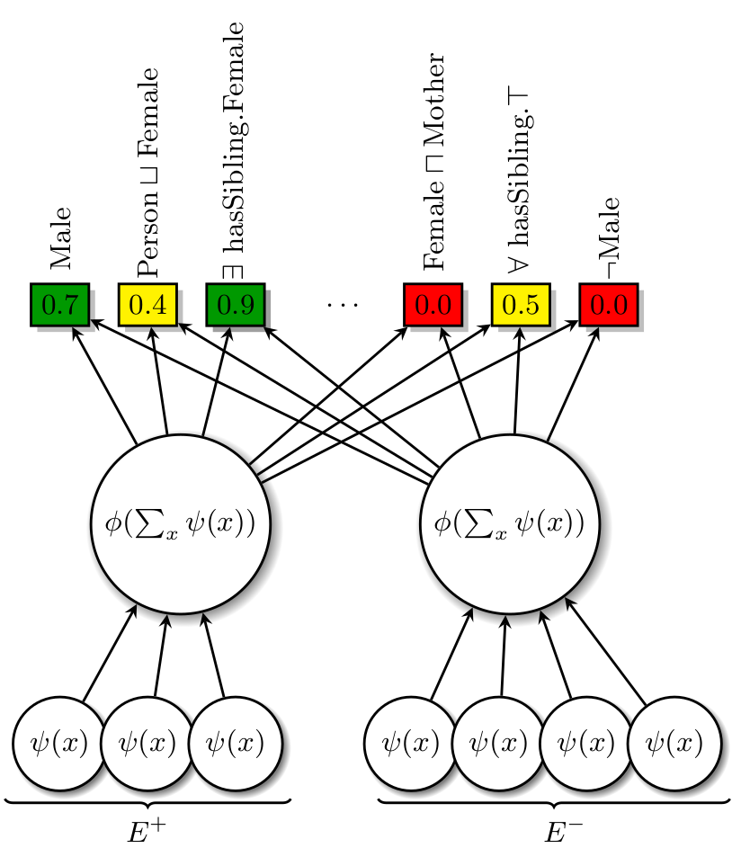
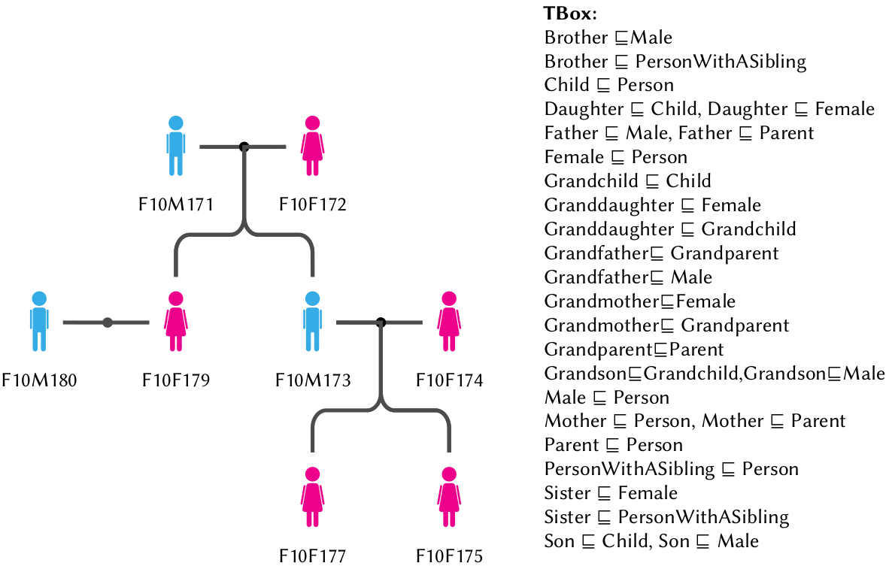
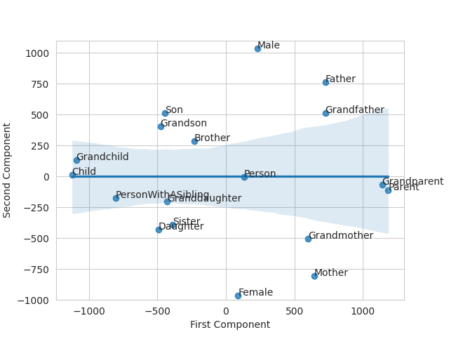

# Learning Permutation-Invariant Embeddings for Description Logic Concepts

Description logic concept learning deals with learning description logic concepts from a knowledge base and input examples. 
The goal is to learn a concept that covers all positive examples, while not covering any negative examples. 
Here, we accelerate the learning process by NERO--permutation-invariant neural embedding model.


Given a knowledge base, positive and negative examples, NERO learns permutation-invariant embeddings for input sets of examples tailored to-
wards predicting F1 scores of pre-selected description logic concepts. By
ranking such concepts in descending order of predicted scores, a possible
goal concept can be detected within few retrieval operations. 
Importantly, top-ranked concepts can be used to start the search procedure of
state-of-the-art symbolic models in multiple advantageous regions of a
concept space, rather than starting in the most general concept ⊤.




# Installation
Create a anaconda virtual environment and install dependencies.
```sh
git clone https://github.com/dice-group/Nero
# Create anaconda virtual environment
conda env create -f environment.yml
# Active virtual environment 
conda activate nero
# Install ontolearn library
wget https://github.com/dice-group/Ontolearn/archive/refs/tags/0.4.0.zip
unzip 0.4.0.zip
cd Ontolearn-0.4.0
python -c 'from setuptools import setup; setup()' develop
python -c "import ontolearn"
cd ..
```
# Datasets and learning problems 
```sh
# Ontologies with assertions and # Learning Problems {(E^+, E^-)}
unzip KGs.zip && unzip LPs.zip
```

# Unsupervised Training
Executing the following script results in training our model on all benchmark datasets with default parameters.
```sh
sh train.sh
```
For each experiment, the following log info is stored.
```sh
2021-11-29 10:04:05,408 - Experimenter - INFO - Knowledge Base being Initialized /../KGs/Lymphography/lymphography.owl
2021-11-29 10:04:05,461 - Experimenter - INFO - Number of individuals: 148
2021-11-29 10:04:05,461 - Experimenter - INFO - Number of named classes / expressions: 49
2021-11-29 10:04:05,461 - Experimenter - INFO - Number of properties / roles : 0
2021-11-29 10:04:05,462 - Experimenter - INFO - Learning Problems being generated
...
2021-11-29 10:04:06,080 - Experimenter - INFO - TrainingRunTime 0.002 minutes
2021-11-29 10:04:06,080 - Experimenter - INFO - Save the loss epoch trajectory
2021-11-29 10:04:06,081 - Experimenter - INFO - Save Weights
2021-11-29 10:04:06,083 - Experimenter - INFO - Training Loop ends
2021-11-29 10:04:06,090 - Experimenter - INFO - Total Runtime of the experiment:0.20418190956115723
```

# Testing
We have provided a test script that facilitates testing a pretrained model on different datasets with different learning problems.
```sh
sh test.sh
```
Expected output: 
```sh
##################
Evaluate NERO on Family benchmark dataset by using learning problems provided in DL-Learner
##################
Iterating over 18 learning problems
#################### 1.LP ####################
Nero learning..
Nero: Prediction: Sister ⊔ (∃ married.Brother)   F1-score: 0.911         Num. explored Expressions: 100
CELOE learning..
CELOE: Prediction: Sister ⊔ (∃ married.Brother)  F1-score:0.911          Num. explored Expressions: 8038
ELTL learning..
ELTL: Prediction: Female         F1-score:0.804  Num. explored Expressions: not reported.
#################### 2.LP ####################
...
ELTL: Prediction: Male   F1-score:0.884  Num. explored Expressions: not reported.
NERO: F-measure:0.984+-0.039    Runtime:0.309+-1.248    NumClassTested:21.056+-37.298
CELOE: F-measure:0.980+-0.053   Runtime:5.015+-3.720    NumClassTested:1457.333+-3270.442
ELTL: F-measure:0.964+-0.091    Runtime:3.559+-0.616    NumClassTested:-1.000+-0.000
Evaluation Ends
```


# Embeddings of Description Logic Expressions
Here, we fit a regression model on 2D embeddings of 1-length expressions. 
Despite the information loss incurred due to PCA, embeddings of 1-length expressions have a distinct structure.

# Deployment
To ease using pre-trained model, we provide an API.
```sh
python deploy_demo.py --path_of_experiments "$PWD/Best/NeroFamily"
# Few seconds later, pretrained model is deployed in a local server
Running on local URL:  http://127.0.0.1:7860/
```


# Integrate DL-Learner
```
# Download DL-Learner
wget --no-check-certificate --content-disposition https://github.com/SmartDataAnalytics/DL-Learner/releases/download/1.4.0/dllearner-1.4.0.zip
unzip dllearner-1.4.0.zip
# Test the DL-learner framework
dllearner-1.4.0/bin/cli dllearner-1.4.0/examples/father.conf
```
## Contact
For any questions or wishes, please contact:  ```caglar.demir@upb.de``` or ```caglardemir8@gmail.com```
