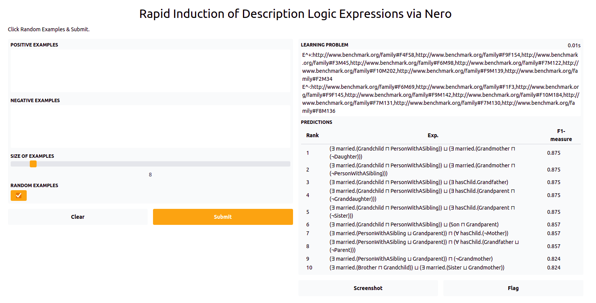
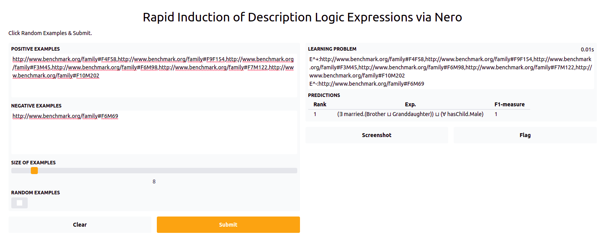

# Neural Class Expression Learner  [Name will be changed]
In this work, we propose a neural model that accurately tackles the class expression learning problem.
Given a learning problem (a set of positive and a set negative examples), our approach leverages the Set-Transformer algorithm to obtain
permutation invariant continues representations for input examples. Via these permutation invariant representations,
our approach learn a sequence of logical formulae (ALC class expressions) that represent hierarchical explanations. 
Hence, predictions of our model are inherently explainable for the inputs.


# Installation
Create a anaconda virtual environment and install dependencies.
```sh
git clone https://github.com/dice-group/DeepTunnellingForRefinementOperators
# Create anaconda virtual enviroment
conda env create -f environment.yml
# Active virtual enviroment 
conda activate deeptunnel
```
# Knowledge Bases and Learning Problems
```sh
unzip KGs.zip
unzip LPs.zip
```

# Unsupervised Training
Executing the following script results in training our model on all benchmark datasets with default parameters.
```sh
sh train.sh
```
For each experiment, the following log info is stored.
```sh
2021-11-29 10:04:05,408 - Experimenter - INFO - Knowledge Base being Initialized /home/demir/Desktop/Softwares/DeepTunnellingForRefinementOperators/KGs/Lymphography/lymphography.owl
2021-11-29 10:04:05,461 - Experimenter - INFO - Number of individuals: 148
2021-11-29 10:04:05,461 - Experimenter - INFO - Number of named classes / expressions: 49
2021-11-29 10:04:05,461 - Experimenter - INFO - Number of properties / roles : 0
2021-11-29 10:04:05,462 - Experimenter - INFO - Learning Problems being generated
...
2021-11-29 10:04:06,080 - Experimenter - INFO - TrainingRunTime 0.002 minutes
2021-11-29 10:04:06,080 - Experimenter - INFO - Save the loss epoch trajectory
2021-11-29 10:04:06,081 - Experimenter - INFO - Save Weights
2021-11-29 10:04:06,083 - Experimenter - INFO - Training Loop ends
2021-11-29 10:04:06,090 - Experimenter - INFO - Total Runtime of the experiment:0.20418190956115723
```

# Testing
A pretrained model can be easily tested by providing two arguments as shown below
```sh
path_knowledge_base="$PWD/Experiments/2021-11-29 10:40:26.076621"
path_of_json_learning_problems="$PWD/LPs/Family/lp_dl_learner.json"
python reproduce_experiments.py --path_of_experiment_folder "$path_knowledge_base" --path_of_json_learning_problems "$path_of_json_learning_problems"

sh test.sh
```

We have also provided a test script for testing pretrained model on different datsets
```sh
sh test.sh
```
# Deployment
To ease using pre-trained model, we provide an API.
```sh
python deploy_demo.py --path_of_experiments "$PWD/Experiments/2021-11-29 10:47:31.373883"
# Few seconds later, pretrained model is deployed in a local server
Running on local URL:  http://127.0.0.1:7860/
```




# Integrate DL-Learner
```
# Download DL-Learner
wget --no-check-certificate --content-disposition https://github.com/SmartDataAnalytics/DL-Learner/releases/download/1.4.0/dllearner-1.4.0.zip
unzip dllearner-1.4.0.zip
# Test the DL-learner framework
dllearner-1.4.0/bin/cli dllearner-1.4.0/examples/father.conf
```


## Acknowledgement 
We based our implementation on the open source implementation of [DRILL](https://arxiv.org/abs/2106.15373).

## Contact
For any further questions or suggestions, please contact:  ```caglar.demir@upb.de```